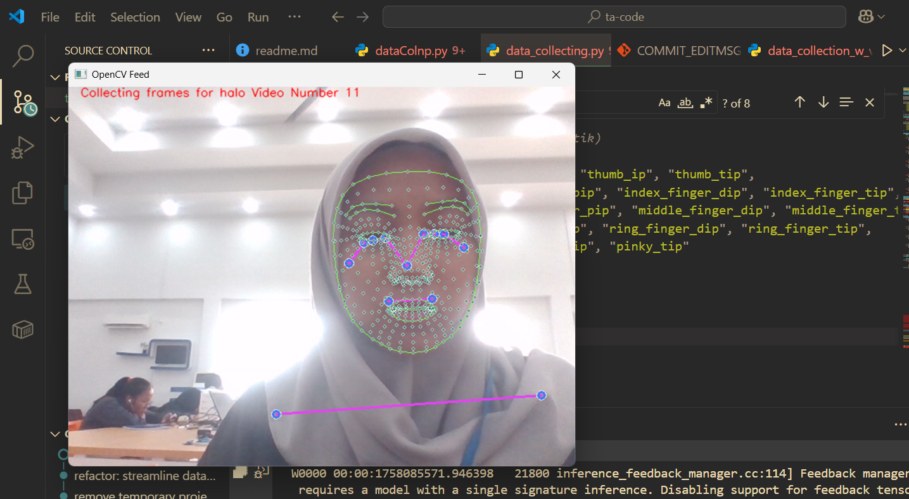

# 📘 Reka Cipta Sistem Penerjemah Bahasa Isyarat Indonesia (BISINDO) ke Teks

Proyek ini merupakan bagian dari **Tugas Akhir** dengan fokus pada penerjemahan gerakan **Bahasa Isyarat Indonesia (BISINDO)** menjadi teks menggunakan **deep learning**.  
Tahap awal penelitian ini dilakukan secara bertahap (preliminary) untuk memahami pipeline data, pemrosesan landmark dengan **MediaPipe**, serta eksplorasi model berbasis **RNN (LSTM & GRU)**.

---

## 🎯 Tujuan Utama

- Membuat sistem yang mampu menangkap gerakan isyarat melalui kamera.
- Mengekstrak landmark wajah, tangan, dan pose menggunakan **MediaPipe Holistic**.
- Melatih model berbasis **RNN** untuk menerjemahkan gestur menjadi teks.

---

## 🔬 Methodology Overview

### 1. Data Acquisition

- Videos of isolated BISINDO gestures are recorded under controlled conditions.
- Each sample represents **one complete sign gesture** with fixed start and end boundaries.

### 2. Landmark Extraction

- **MediaPipe Holistic** is used to extract:

  - Body pose landmarks
  - Hand landmarks
  - Facial landmarks

- Each landmark is represented as normalized 2D coordinates.

### 2️⃣ Tahap Kedua: JSON

- Data sequence disimpan dalam format **JSON** agar lebih mudah dibaca dan diinspeksi.
- Struktur JSON mencakup:
  - Metadata (id video, fps, jumlah frame, jumlah landmark).
  - Frame-by-frame landmark (pose, face, tangan kiri, tangan kanan).
- Proses pengumpulan data dilakukan dengan menyimpan sequence gerakan dalam format JSON.
- Setiap file JSON mewakili satu video gesture dengan struktur yang telah ditentukan.
- Tujuan utama: **mempersiapkan dataset standar** untuk pelatihan model serta mengumpulkan dataset yang cukup untuk eksplorasi model.
- File JSON yang dihasilkan dapat digunakan langsung untuk eksplorasi model.

---

## 🔮 Rencana Selanjutnya

- **Model Awal:** LSTM digunakan sebagai baseline untuk memproses sequence gesture → teks.
- **Model Lanjutan:** Mengeksplorasi **GRU** untuk membandingkan performa dan efisiensi.
- Evaluasi dilakukan berdasarkan **akurasi penerjemahan** serta **kecepatan inferensi**.

---

## ✨ Catatan

- Dataset saat ini masih dalam tahap awal (gesture sederhana seperti _halo_, _terima kasih_).
- Format penyimpanan akan terus dieksplorasi hingga didapat format optimal untuk pelatihan model.
- Dokumentasi ini akan terus diperbarui seiring perkembangan proyek.
